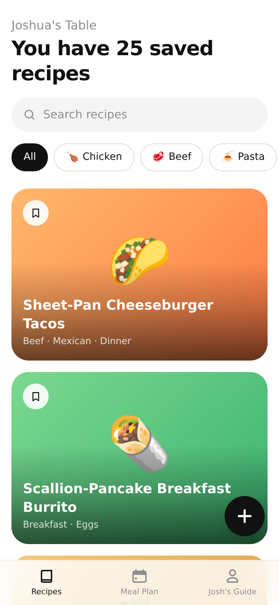
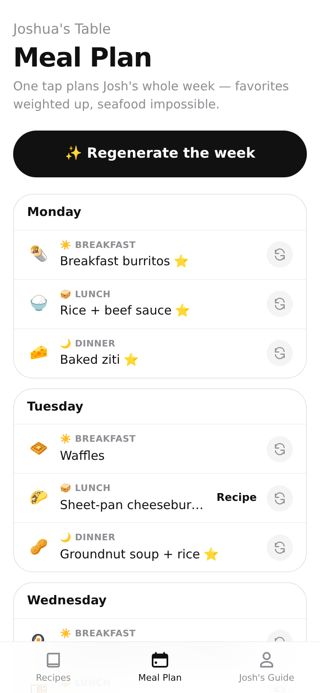
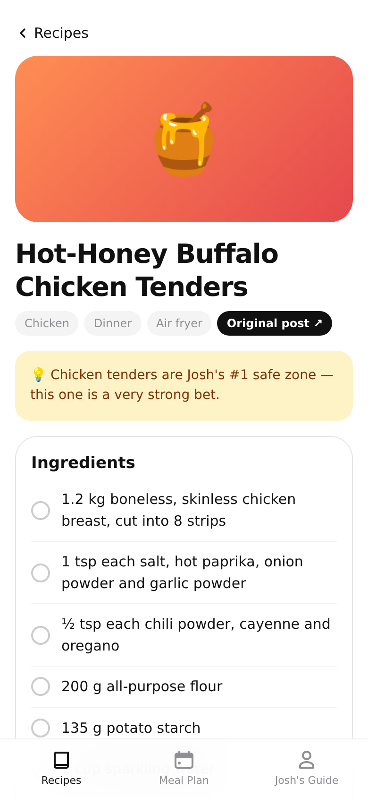
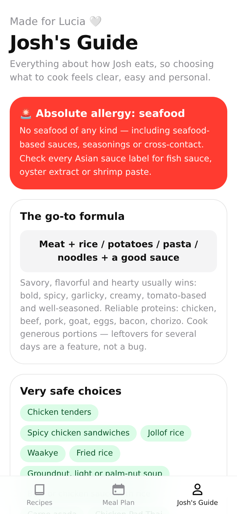

# Joshua's Table 🍽️

A personal food app made for Lucia — everything about how Josh eats, so choosing
what to cook feels clear, easy and personal.

- **Recipes** — searchable, filterable gallery of Josh's saved Instagram recipes + idea bank
- **Meal Plan** — one tap plans the whole week (favorites weighted 3×, seafood impossible,
  lunches can be leftovers because Josh loves big portions)
- **Josh's Guide** — the allergy banner, go-to formula, safe choices, don't-make list and
  the full category-by-category food guide

| Recipes | Meal Plan | Recipe | Josh's Guide |
|---|---|---|---|
|  |  |  |  |

## Run it

```bash
npm install
npm run dev
```

Built with Next.js 15 + Tailwind + Framer Motion. Fully static — deploys to Vercel as-is.
Logic check: `node --experimental-strip-types lib/selfcheck.ts`
